# Workshop: Fusion Triggers & Invokes

## Trigger via business events

This lab will show how to configure ERP as an integration trigger.

## Objectives

•	Create an integration to listen for a business event in ERP

### Outline
1. Configure ERP to send business events to OIC
2. Create the integration
3. Performan the ERP business event
4. Test & monitor the integration 

## Reference

This is also how your integration will look at the end of the walkthrough.

During the walkthrough, relevant instructions will be UNDER the picture they correlate with.

# Walkthrough

## 1.	Configure ERP to send business events to OIC

View these links from the a-team to learn how to configure ERP to send business events to OIC. 

[Using Business Events in Fusion-based SaaS with Oracle Integration Cloud - Part 1](https://blogs.oracle.com/imc/subscribe-to-business-events-in-fusion-based-saas-applications-from-oracle-integration-cloud-oic-part-1-prerequisites)

[Using Business Events in Fusion-based SaaS with Oracle Integration Cloud - Part 2](http://www.ateam-oracle.com/using-business-events-with-integration-cloud-part-2)

After doing the above configuration, you can create the connection with the adapter in OIC. 

In OIC, select the Oracle ERP cloud adapter.

Name your connection.

Configure your connection details, all of these fields need to be filled out. [Further details on the fields are here.](https://docs.oracle.com/en/cloud/paas/integration-cloud-service/icser/creating-connection.html#GUID-1B92F72F-4AA8-4C2B-9E93-8F9760EEE859)

## 2. Create the integration to receive the item creation data 

Create an app driven orchestration integration. Then start the integration with your ERP connection.

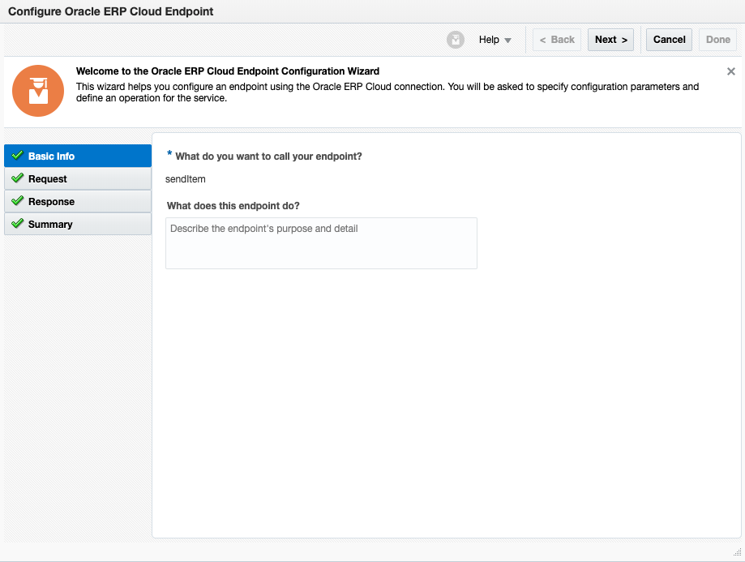

Give a name to your endpoint. 

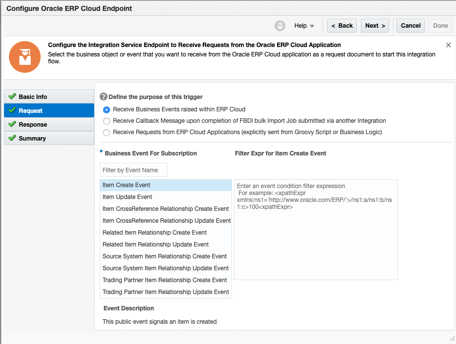

Configure the request page to receive busienss events from ERP cloud, then select item create event. 

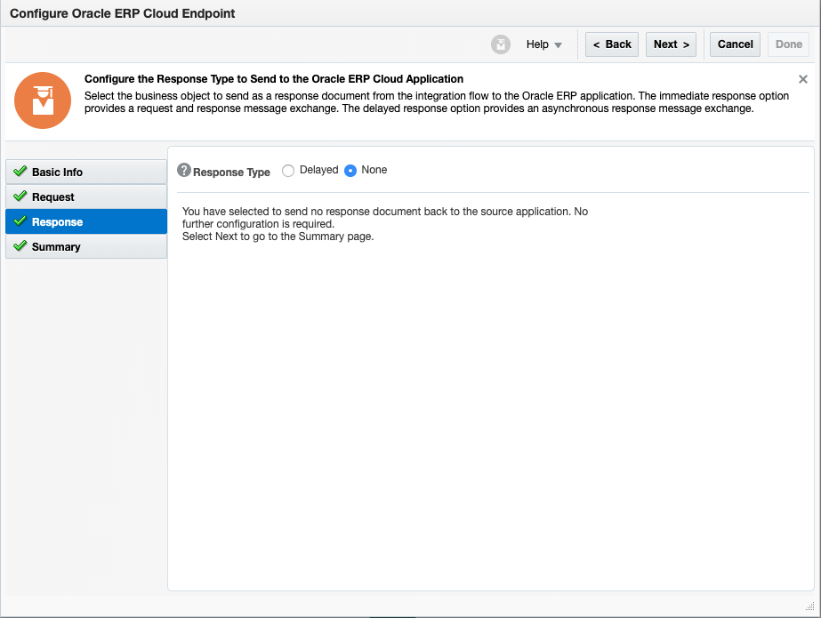

You do not need to configure a response to be received. 

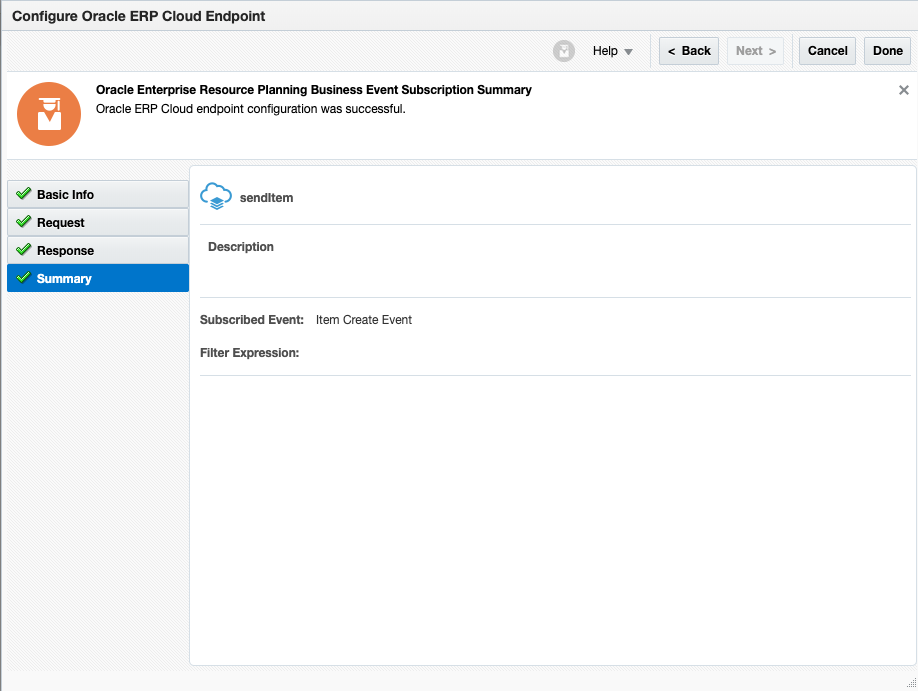

This is the summary of the item create event subscription.

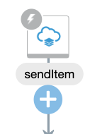

Below your ERP connection, click the plus sign and place your SOAP-CPQ connection configured in lab 100. Configure it exactly the same. 

After doing that, your integration should look like this, open the mapper by pressing the pen button that appears after clicking the mapper. 

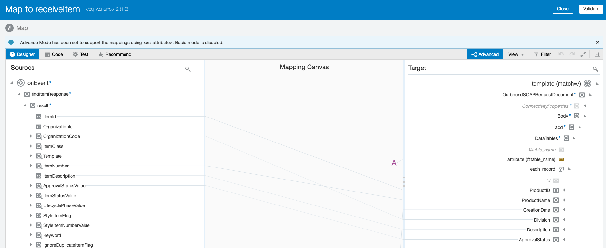

This is how your mapper should appear after it is completed. See lab 100 for how to create the 'attribute(@table_name) field. For the other fields, map: 

ItemId -> ProductID
OrganizationCode -> Division
ItemNumber -> ProductName
ItemDescription -> Description
ApprovalStatusValue -> ApprovalStatus
CreationDate -> CreationDate

Lastly, don't forget to specify a field for tracking. 

## 3. Create an item in ERP 

[Watch this video to see PO creation](https://www.youtube.com/watch?v=jCUEBjNi86k)

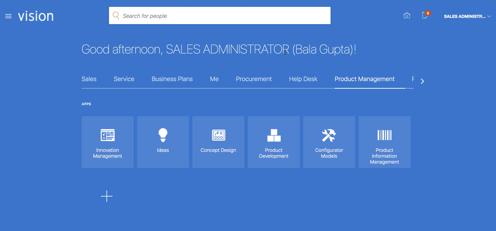

From the ERP homepage, navigate to the Product Information Management suite.

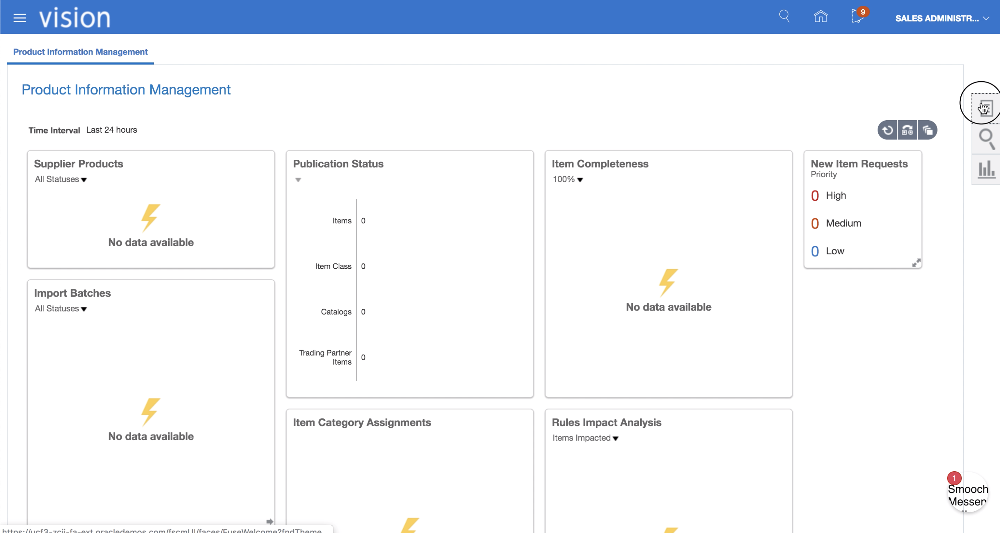

Click the side bar on the right. 

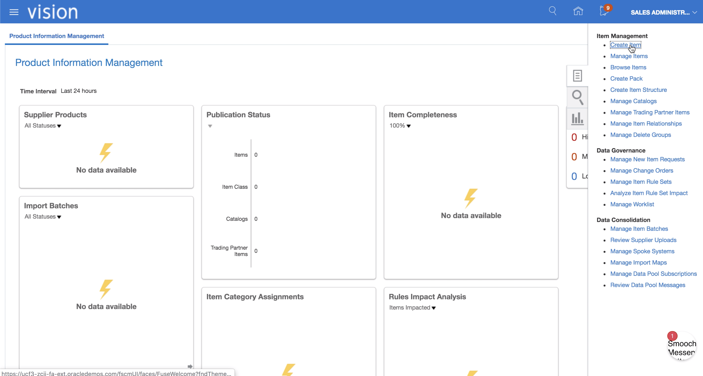

Click on create item.

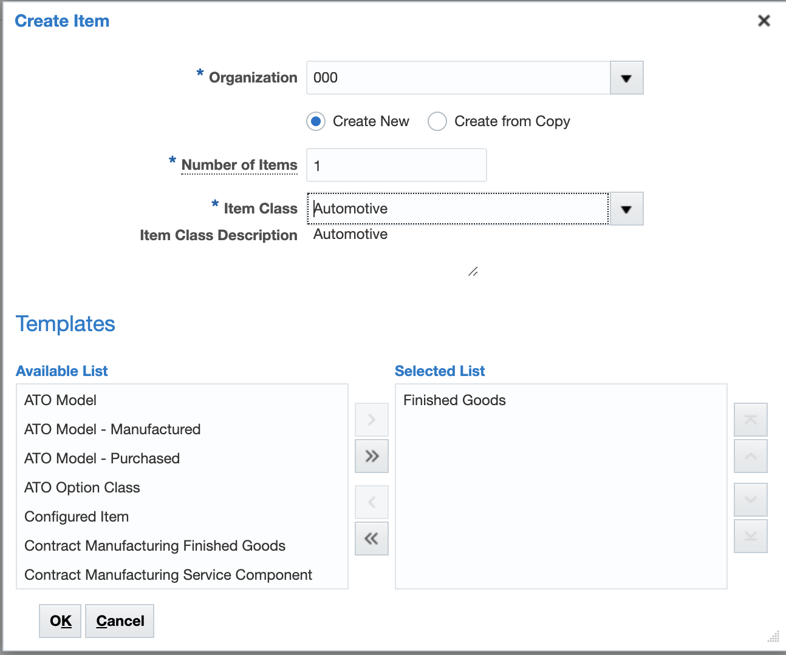

These details can vary per your use case, here we select these fields. 
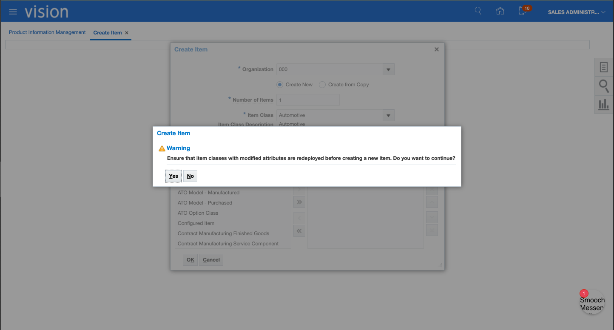

Press yes if you get this warning. 
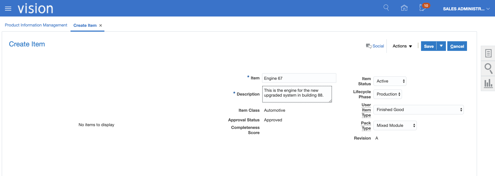

Enter the details for your item. 

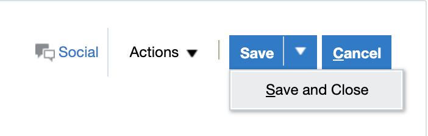

Save and close. This will trigger the business event that a new item was created. The information will be passed to Oracle Integration. 

## 4. Verify & monitor the integration

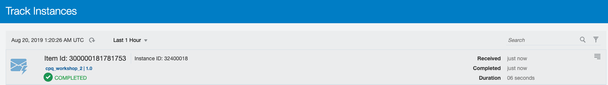

On the monitoring page you should see a completed integration. 

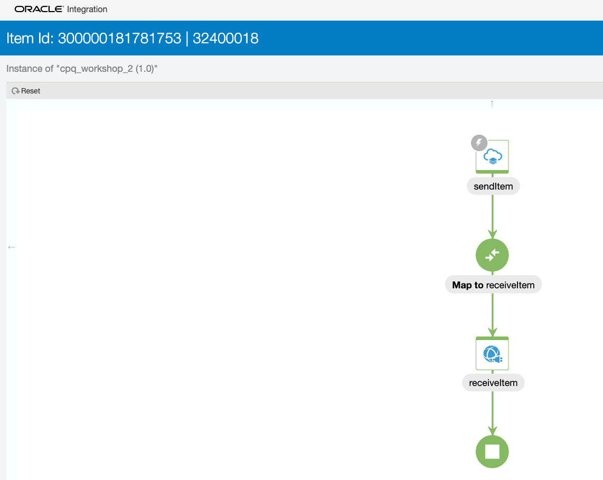

Clicking on the tracking shows green for each stage of the integration. 

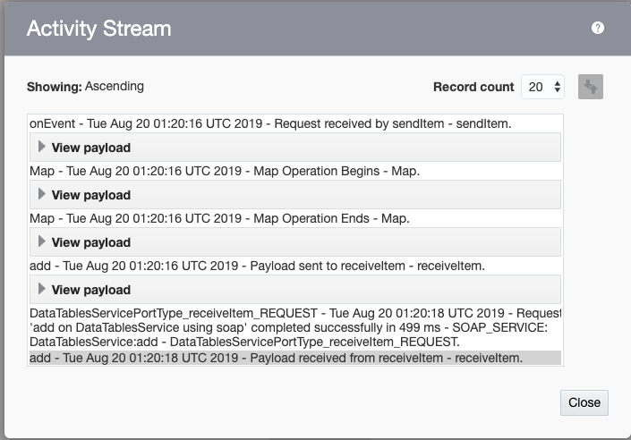

Viewing the activity stream allows you to view the payloads at each step. 

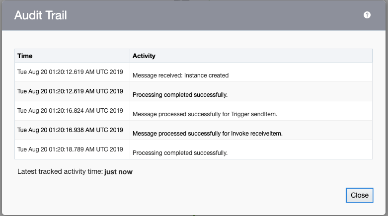

The audit trails shows the actions that occured in the integration.

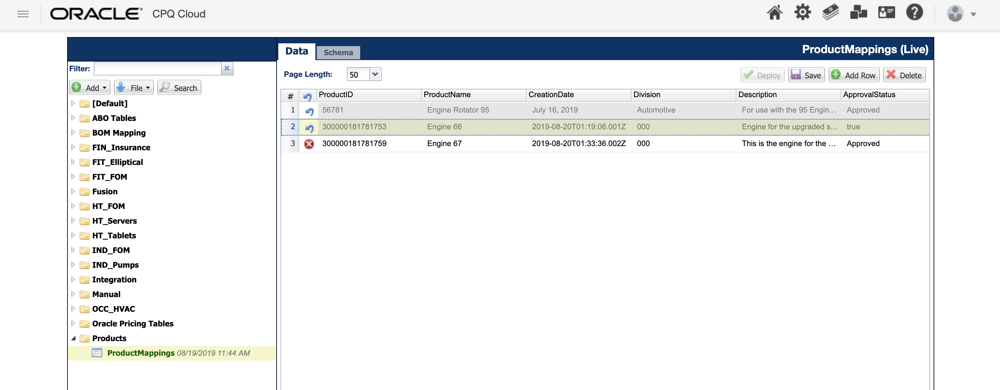

Looking at the data table in CPQ, you can see the new row with our information from ERP. 

You can watch the Demo1 video to confirm that you completed the lab successfully. 

## Invoke

https://docs.oracle.com/en/cloud/saas/procurement/18b/oeswp/Purchase-Order-Service-Version-2-PurchaseOrderService-svc-3.html

https://blogs.oracle.com/cloud-infrastructure/using-terraform-to-manage-your-apis

CREATE TABLE Opportunity (
   POHeaderId VARCHAR2(255),
   OrderNumber VARCHAR2(255),
   BuyerName VARCHAR2(255),
   BuyerEmail VARCHAR2(255),
   ItemNumber VARCHAR2(255),
   ItemId VARCHAR2(255)
);

