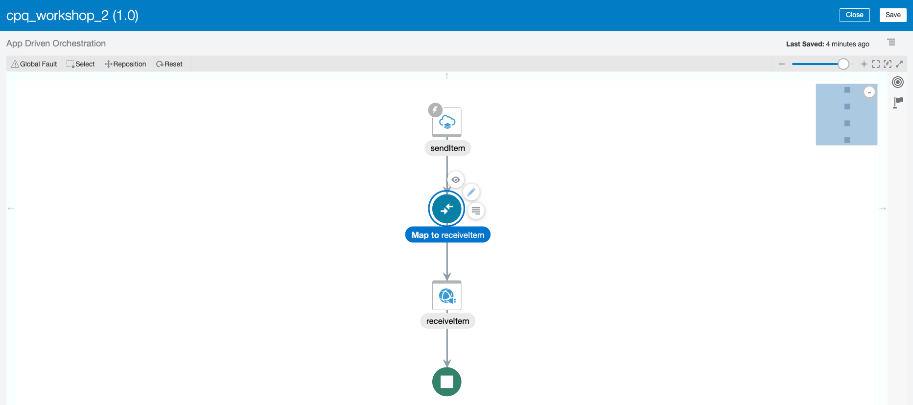

# Workshop: Fusion Triggers & Invokes

## Trigger via business events

This lab will show how to configure ERP as an integration trigger.

## Objectives

•	Create an integration to listen for a business event in ERP

### Outline
1. Configure ERP to send business events to OIC
2. Create the integration
3. Performan the ERP business event
4. Test & monitor the integration 

## Reference

This is also how your integration will look at the end of the walkthrough.

During the walkthrough, relevant instructions will be UNDER the picture they correlate with.

# Walkthrough

## 1.	Configure ERP to send business events to OIC

View these links from the a-team to learn how to configure ERP to send business events to OIC. 

[Using Business Events in Fusion-based SaaS with Oracle Integration Cloud - Part 1](https://blogs.oracle.com/imc/subscribe-to-business-events-in-fusion-based-saas-applications-from-oracle-integration-cloud-oic-part-1-prerequisites)

[Using Business Events in Fusion-based SaaS with Oracle Integration Cloud - Part 2](http://www.ateam-oracle.com/using-business-events-with-integration-cloud-part-2)

After doing the above configuration, you can create the connection with the adapter in OIC. 

In OIC, select the Oracle ERP cloud adapter.

Name your connection.

Configure your connection details, all of these fields need to be filled out. [Further details on the fields are here.](https://docs.oracle.com/en/cloud/paas/integration-cloud-service/icser/creating-connection.html#GUID-1B92F72F-4AA8-4C2B-9E93-8F9760EEE859)

## 2. Create the integration to receive the item creation data 

## 3. Create an X in ERP 

[Watch this video to see PO creation](https://www.youtube.com/watch?v=jCUEBjNi86k)

## 4. Verify & monitor the integration

