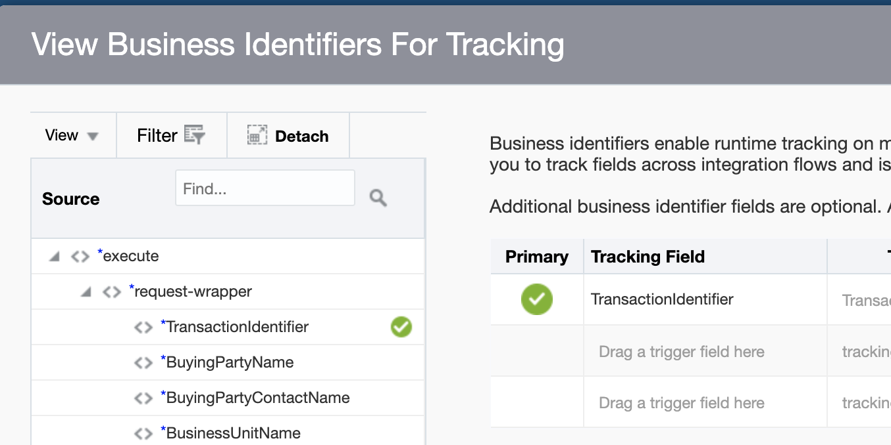

# Workshop: Fusion & Oracle Integration & Apiary


How to receive business events from Fusion and create purchase orders with OIC. 

## Objectives

This lab will show how to configure ERP as an integration trigger with the ERP adapter, and how to invoke it.

### Outline ### [CMD/CTRL F to skip to relevant part]

#### Pre-requisites
1. Configure ERP to send business events to OIC
2. Connect ERP adapter
3. Create a free apiary account

#### Generic REST Trigger walkthrough, creation
1. Verify you have a Generic REST trigger
2. Create an app-driven orchestration
3. Submit a payload with Postman
4. Tracking & Activity Stream

#### Generic REST Trigger walkthrough, querying
1. Verify you have a Generic REST trigger
2. Create an app-driven orchestration
3. Submit a payload with Postman
4. Tracking & Activity Stream

#### SaaS Trigger walkthrough
1. Create an apiary mock endpoint
2. Create the integration
3. Mapping
4. Performan the ERP business event
5. Test & monitor the integration 

#### Scheduled Invoke walkthrough

#### FBDI

# Pre-requisites 

## 1.	Configure ERP to send business events to OIC* 

**While this is only necessary for the 2nd walkthrough, this may take a while to properly configure.**

*this is only necessary for the SaaS trigger walkthrough*

View these links from the a-team to learn how to configure ERP to send business events to OIC. 

[Using Business Events in Fusion-based SaaS with Oracle Integration Cloud - Part 1](https://blogs.oracle.com/imc/subscribe-to-business-events-in-fusion-based-saas-applications-from-oracle-integration-cloud-oic-part-1-prerequisites)

[Using Business Events in Fusion-based SaaS with Oracle Integration Cloud - Part 2](http://www.ateam-oracle.com/using-business-events-with-integration-cloud-part-2)

After doing the above configuration, you can create the connection with the adapter in OIC. 

## 2. Create a free apiary account

You can create a free Apiary account [here](https://login.apiary.io/register). *It is only necessary for the SaaS trigger walkthrough as well.*

## 3. Use Cloud ERP adapter to make a connection to ERP


In OIC, select the Oracle ERP cloud adapter.


Name your connection.


Configure your connection details, all of these fields need to be filled out. [Further details on the fields are here.](https://docs.oracle.com/en/cloud/paas/integration-cloud-service/icser/creating-connection.html#GUID-1B92F72F-4AA8-4C2B-9E93-8F9760EEE859)

# Generic REST Trigger Walkthrough, order creation

The .iar file for this integration is in this repo, ERP_CREATE_ORDER.iar. If you import this to your environment, update the connection details to use your environments before activating the integration.

## Verify you have a Generic REST trigger


Under connections, verify you have a generic or all purpose REST trigger.


It is just a REST adapter with no details. This is what we use when using OIC as a 'drag & drop API builder.' 


## Create an app-driven orchestration


Return to the integrations tab and create an app-driven orchestration.


Name your integration. 


This is what your integration will look like at the end. Begin by placing your generic REST adapter on the canvas. 


Input these details.


Configure a payload & response. On the request and response page, select JSON and press the blue inline text. Insert these payloads.

Request:
```
{
  "TransactionIdentifier" : "Creekside Warehouse-14073",
  "BuyingPartyName" : "Pinnacle Technologies",
  "BuyingPartyContactName" : "Isaac Nelson",
  "BusinessUnitName" : "US1 Business Unit",
  "ShipToPartyIdentifier" : "A100000000409220",
  "ShipToPartyName" : "Pinnacle Technologies",
  "BillToCustomerName" : "Pinnacle Technologies",
  "ShipToPartySiteIdentifier" : "A300000048361113",
  "BillToAccountSiteUseIdentifier" : "A300000048361115",
  "OrderItems" : [ {
    "ProductId" : "AS46336",
    "Quantity" : 3
  }, {
    "ProductId" : "AS46336",
    "Quantity" : 3
  } ]
}
```

Response:
```
{
  "orderNumber" : "A11231",
  "orderStatus" : "Success"
}
```


Select the CRUD action.


Select the order import service and the createOrders action.


Your summary page should look like this.

## Mapping between REST & Fusion, activating your integration

There are many fields an Order will take in Fusion. Read the 'treatise' portion of this [article](https://github.com/GaryHostt/Oracle_Integration/blob/master/README.md) to understand how you should tackle novel mapping situation. The screenshots below show the mapping for the fields if you do not copy the .iar. 


For the f(x) mappings, you will use the XSLT functions shown in the following screenshots. 


You can hardcode these values:


Resume with these mappings:


These are all the request mappings:


This is the mapping for the response back to the REST adapter:


Don't forget to add a field to tracking:


Now you can activate your integration.

## Using Postman


After adding your basic auth to the authorization tab, you can submit your request with the below payload, or you can copy the payload from the metadata endpoint of your activated integration.

Some fields have been made blank to attempt to alleviate the difficulties of interacting with different ERP systems. 
```
{ "TransactionIdentifier": "Creekside Warehouse-14073", "BuyingPartyName": "Pinnacle Technologies", "BuyingPartyContactName": "Isaac Nelson", "BusinessUnitName": "US1 Business Unit", "ShipToPartyIdentifier": "", "ShipToPartyName": "Pinnacle Technologies", "BillToCustomerName": "Pinnacle Technologies", "ShipToPartySiteIdentifier": "", "BillToAccountSiteUseIdentifier": "", "OrderItems": [ { "ProductId": "AS46336", "Quantity": 3 }, { "ProductId": "AS46336", "Quantity": 3 } ] }
```


You can use the activity stream from the tracking page to see if there were any problems with your integration. Click the underlined Message (or your equivalent).


The message reveals that there was a problem with the Bill_to_site_use_id. From here we can troubleshoot the fields line by line.

#### Generic REST Trigger walkthrough, querying bank accounts
1. Verify you have a Generic REST trigger
2. Create an app-driven orchestration
3. Submit a payload with Postman
4. Tracking & Activity Stream

# SaaS Trigger Walkthrough

## 1. Create the apiary mock endpoint


After copying the apiary blue print at the bottom of this lab, you can get your base URL from the location in the screenshot above.


Create a REST connection and type your base url, make sure you have no security policy selected.

## 3. Create the integration to receive the PO data upon creation

Create an app driven orchestration integration. Then start the integration with your ERP connection.

## 4. Create a PO in ERP 

## 5. Verify & monitor the integration on OIC & Apiary

[Watch this video to see PO creation](https://www.youtube.com/watch?v=jCUEBjNi86k)

# Invoke Walkthrough

[This is the SOAP endpoint we will be using](https://docs.oracle.com/en/cloud/saas/procurement/18b/oeswp/Purchase-Order-Service-Version-2-PurchaseOrderService-svc-3.html)


# Further work

[Creating POs with VBCS](http://niallcblogs.blogspot.com/2019/03/695-oic-subscribing-to-fusion-erp.html)

[Using a Digital Assistant Custom skill to create a PO](https://github.com/oracle/bots-node-sdk)


## Apiary blueprint
```
FORMAT: 1A
HOST: https://polls.apiblueprint.org/

# PO_Creation

This is a simple API allowing the receiving of PO fields from Fusion ERP.

## Questions Collection [/purchaseOrders]

### Post a PO [POST]

You may create your own question using this action. It takes a JSON
object containing a question and a collection of answers in the
form of choices.

+ Request (application/json)

        {
            "OrderNumber": "12345",
            "POHeaderId": 1234,
            "ProcurementBusinessUnit":"12345",
            "BuyerEmail":"email@email.com"
        }

+ Response 201 (application/json)

    + Headers

            Location: /PO/2

    + Body

            {"status":"success"}

```

